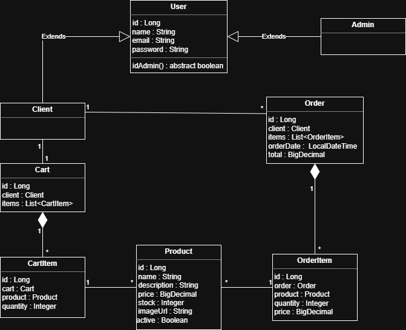

  <h1 align="center"> Relatório do Projeto Final</h1>


* **Título do projeto**: MagixStore
* **Tema**: E-Commerce
* **Integrantes da equipe**: Arthur Gomes Pedroza
* **Disciplina**: Programação Orientada à Objetos
* **Professor**: Gabriel Belarmino

---

### Introdução:

A plataforma trata-se de um sistema de **e-commerce**, onde a experiência se divide em **duas**:

* **Cliente**
* **Administrador**

O **cliente** pode acessar o site, **visualizar** os produtos que estão disponíveis, fazer seu **cadastro** ou realizar **login**(caso já possua uma conta), **adicionar itens** no carrinho e **realizar compras**, que ficam salvas em um **histórico** de pedidos de cada cliente.

No caso do **administrador**, um acesso diferente surge assim que ele faz login na plataforma, **o painel de administração**. Nesse painel o administrador consegue ter total controle dos produtos que estão disponíveis para a venda. Ele pode **gerar** novos produtos, **editar** os que já existem e **deletar** quando necessário.

Em resumo, a plataforma é, basicamente, um simples **CRUD**.

---

### Modelagem: 



Como existem **dois tipos** de usuários distintos com diferentes intenções e permissões, foi pensado de início em criar uma classe-mãe **User** e as classes-filhas **Client** e **Admin**. Desse modo, foi possível fazer o sistema identificar o tipo de usuário utilizando de **herança** e **polimorfismo**, com o método abstrato isAdmin() do tipo boolean, que retorna true quando o usuário é administrador.

Com essa lógica do usário pronta, foi pensado no restante das relações do sistema para que pudesse funcionar da melhor forma, primeiramente foi feita a modelagem da classe **Product**, pensando nas funcionalidades essenciais e com um atributo do tipo boolean que foi usado para saber se o produto está disponível ou não de acordo com o estoque.

Após essas modelagens terem ficado prontas, as modelagens de **Cart** e **Order** foram feitas. Ambas não poderiam acessar diretamente os produtos, pois não seria possível adicionar várias quantidades de um mesmo produto ao carrinho reconhecendo que não são produtos diferentes. E em relação aos pedidos, não seria possível armazenar o histórico de cada produto de maneira correta.

Tendo em vista esse problema, foram criadas as classes **CartItem** e **OrderItem**, que agem como uma espécie de ponte:

> Cart -> CartItem -> Product 

> Order -> OrderItem -> Product

Sob esse viés, tudo pode funcionar como deve. O carrinho identifica que mais unidades de um produto estão sendo adicionadas ao invés de diferentes itens, e o pedido consegue guardar o histórico de produtos corretamente, mesmo que aumente ou diminua o preço, vai estar salvo de acordo com o que o usuário comprou.

Todos os atributos foram encapsulados devidamente em cada entidade. Para as exceções, foi utilizado do tratamento de exceções globais, na seguinte estrutura.

```
-GlobalExceptionHandler
-UserNotFoundException
-EmailAlreadyExistsException
-InvalidPasswordException
-ProductNotFoundException
-OrderNotFoundException
-CartItemNotFoundException
```

Conforme foram surgindo exceções que se repetiam com certa frequência, foram criadas as devidas exceções personalizadas, com uma mensagem de erro única e protocolo http correto.

No fim, cada cliente pode ter um carrinho, que pode conter vários itens(produtos) e pode finalizar a compra, que, por sua vez, fica salva no histórico de pedidos. E o Admin fica responsável prela criação, edição e exclusão de produtos.

---

### Ferramentas utilizadas:

No **back**:
* VSCode(IDE)
* IntelliJ(IDE)
* Spring
* Lombok
* Spring Security
* PostGreSql
* Spring Web
* Spring Data JPA
* JWT
* Swagger
* Postman

No [**front**](https://github.com/agp2611/magixStore-front):
* VSCode(IDE)
* AntiGravity(IDE)
* React
* TailwindCSS
* Lucide React
* React Router Dom


### Estrutura dos pacotes: 

* 📂config
   * OpenApiConfig.java
   * SecurityConfig.java
   * SecurityFilter.java
* 📂controller
   * AuthController.java
   * CartController.java
   * OrderController.java
   * ProductController.java
* 📂dto
   * LoginRequestDto.java
   * LoginResponseDto.java
   * RegisterRequestDto.java
* 📂exception
   * GlobalExceptionHandler
   * UserNotFoundException
   * EmailAlreadyExistsException
   * InvalidPasswordException
   * ProductNotFoundException
   * OrderNotFoundException
   * CartItemNotFoundException
* 📂model
   * User.java
   * Admin.java
   * Client.java
   * Product.java
   * Cart.java
   * CartItem.java
   * Order.java
   * OrderItem.java
* 📂repository
   * UserRepository.java
   * ProductRepository.java
   * CartRepository.java
   * CartItemRepository.java
   * OrderRepository.java
* 📂service
   * AuthService.java
   * ProductService.java
   * CartService.java
   * OrderService.java
   * TokenService.java
* Application.java
---

<h1 align="center"> Como excutar o projeto localmente</h1>

Para isso, é necessário ter **instalado**:
* **Java 21**(ou superior)
* **PostGreSQL**
* **Node.js**

### 1. Preparando o banco de dados
* Abra o seu SGBD (pgAdmin, DBeaver, etc.) e crie um banco de dados vazio chamado `magixstore`.
* O projeto está configurado com um arquivo `data.sql` que, ao iniciar o back-end pela primeira vez, criará automaticamente todas as tabelas e povoará a vitrine com 36 produtos e um usuário Administrador padrão.

### 2. Rodando o Back-end (Spring Boot)
1. Clone este repositório:
   ```bash
   git clone https://github.com/agp2611/magixStore-back.git
2. Abra na sue IDE de preferência(VSCode, IntelliJ...)

3. Navegue até o arquivo src/main/resources/application.yml e certifique-se de que as credenciais do banco de dados (usuário e senha) correspondem às da sua máquina local:

   ```yml
   datasource:
      url: jdbc:postgresql://localhost:5432/magix_store
      username: seu_ususario_postgres
      password: sua_senha_postgres
4. Execute o arquivo principal `Application.java` ou rode via maven:

   ```bash
   ./mvnw spring-boot:run
A API estará disponível em `http://localhost:8081`

### Rodando o [Front-end](github.com/agp2611/magixStore-front)

1. Clone o repositório do front-end:
   ```bash
   git clone https://github.com/agp2611/magixStore-front.git
2. Abra o terminal na pasta do projeto e instale as dependencias:
   ```bash
   npm install
3. Inicie o servidor de desenvolvimento:
   ```bash
   npm run dev
4. O portal de acesso abrirá no seu navegador em `http://localhost:5173`.

### Credenciais de acesso(geradas automaticamente)

Para testar o Painel de Administração e o CRUD de produtos utilize as seguintes credenciais(injetadas via script na primeira execução)

* admin@adm.com
* 123456

Ou se quiser gerar outro administrador, mude diretamente no banco a role de um cliente ou insira em `src/main/resources/data.sql`

---

### Resultados e considerações finais:

Ao final foi possível alcançar o objetivo inicial com um CRUD 100% funcional e a lógica funcionando exatamente como o esperado em uma longa jornada de aprendizado. Foi possível absorver ainda mais sobre o conceito de orientação a objetos trabalhando de perto com um projeto real, além da experiência com ferramentas do mercado como o Spring e API Rest. Ao longo do desenvolvimento surgiram algumas dúvidas, alguns bugs, alguns erros lógicos e, sem dúvidas, foram eles que trouxeram o verdadeiro conhecimento. Além de tudo foi gratificante ver o primeiro projeto tomar vida conforme os dias se passaram e, ao fim, ver ele funcionando exatamente como o esperado, onde somente administradores conseguem acessar suas devidas funções, as informações do usuário são tratadas e armazenadas com segurança no banco, um cliente consegue comprar produtos que estejam disponíveis e com estoque, e, a cada compra, o pedido ficar salvo e o estoque do produto diminui. A maior dificuldade foi, de fato, com o frontend que nunca havia tido contato, foi um verdadeiro desafio, mas que deu tudo certo.

A experiência com a disciplina foi excelente, foi possível absorver tudo que era necessário da linguagem Java tanto com as aulas quanto ao decorrer do desenvolvimento do projeto final e, principalmente, os conceitos de orientação a objetos que, no início, eram bem rasos e agora estão bem consolidados. 